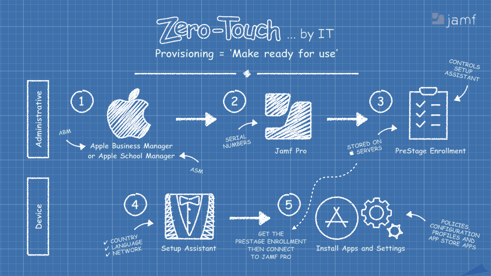
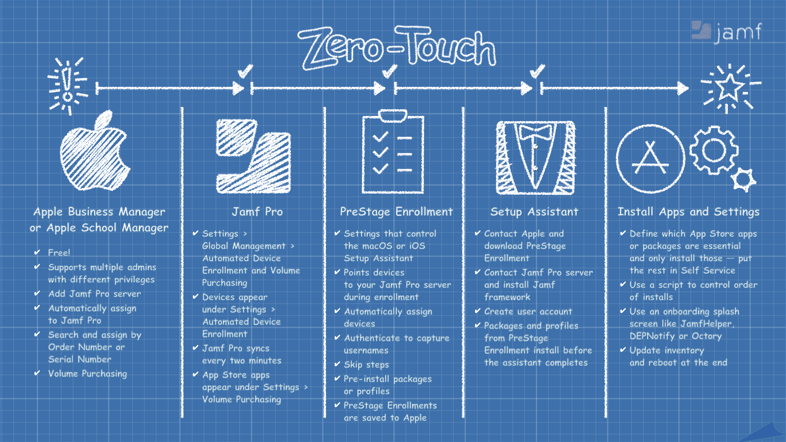

# How to Make Zero-Touch Deployments a Reality
Resources for Jamf's November 2020 webinar

## For Enterprise

### Get started with Apple Business Manager

Whether your organization has ten devices or ten thousand, Apple fits easily into your existing infrastructure. Zero-touch deployment allows IT to configure and manage remotely, and IT can tailor the setup process to any team. So every Mac, iPad, iPhone, and Apple TV is ready to go from the start.

[https://www.apple.com/business/it/](https://www.apple.com/business/it/)

### Connect Jamf Pro to Apple Business Manager

Video lesson explaining how to connect your Jamf Pro server to your Apple Business Manager account. Connecting Jamf to Apple is a requirement for Zero-Touch enrollment.

[Jamf Training Catalog: Integrating with Apple Business Manager](https://trainingcatalog.jamf.com/integrating-with-apple-business-manager)

---

## For Education

### Get started with Apple School Manager

Whether you’re planning a brand new deployment, or adding Apple devices into your existing infrastructure, iPad and Mac fit right in. And now with Microsoft Azure Active Directory support, it’s easier than ever to provide your students and staff with access to key Apple services for teaching and learning. All the apps and services your teachers and students need every day, like Google Drive and Microsoft Office, are available on iPad. And with the countless creative tools iPad offers, students are empowered to express their learning any way they like.

[https://www.apple.com/education/k12/it/](https://www.apple.com/education/k12/it/)

### Connect Jamf Pro to Apple School Manager

Video lesson explaining how to connect your Jamf Pro server to your Apple School Manager account. Connecting Jamf to Apple is a requirement for Zero-Touch enrollment.

[Jamf Training Catalog: Integrating with Apple School Manager](https://trainingcatalog.jamf.com/integrating-with-apple-school-manager)

---

## For Everyone

### AppleSeed for IT

A program where customers can test pre-release software products in order to provide Apple with real-world quality and usability feedback. Every device administrator in an Apple Business Manager or Apple School Manager is eligible to participate. Sign up and sign in with the same Apple ID associated to your Enterprise or Education account.

[Software Customer Seeding](https://appleseed.apple.com/sp/welcome)

### Configuring PreStage Enrollment settings

Video lesson overview for preparing a PreStage Enrollment for automated device enrollment.

[Jamf Training Catalog: Automated Device Enrollment and PreStage Enrollments](https://trainingcatalog.jamf.com/device-enrollment-program-dep-1)

### Configuring volume purchasing and deployment of Apps & Books

Video lesson overview for integrating Apple's Apps & Books service with Volume Purchasing in Jamf Pro.

[Jamf Training Catalog: Volume Purchasing](https://trainingcatalog.jamf.com/volume-purchasing)

### Deploy Basic Scripts with Jamf Pro

Video lesson overview for deploying basic scripts with policies in Jamf Pro.

[Jamf Training Catalog: Deploy Basic Scripts](https://trainingcatalog.jamf.com/deploy-basic-scripts-1)

### About Provisioning.zsh sample script

This is the same Mac script (iOS devices cannot run scripts) deployed at the end of the video demonstrating a provisioning workflow. Reuse and modify as you like. It includes:

* A function for creating a log file at /var/log/Provisioning.log.
* A wait loop that prevents the script from continuing to run until a user has logged in and a Dock appears.
* An example for displaying a dialog to the end user for entering an asset tag number or other piece of information.
* A loop for displaying a JamfHelper full screen window to display progress
* An update inventory command that also populates the Asset Tag field in a device record ( /usr/local/bin/jamf recon -assetTag "$assetTag" ).
* A restart command with a delay of one minute to allow the policy to complete and update the log in Jamf Pro.

To use this script as-is, modify this section near the beginning of the script to include statuses and custom trigger names for the policies you wish to run in the order they should run. Consider installing security software that may scan activity toward the end of the installation.

>     # Policy names and policy triggers separated by ","
> 
>     policyList="Installing Google Chrome,maininstallgooglechrome
>     Installing Microsoft Office 2019,maininstallmicrosoftoffice
>     Installing Zoom,main-zoom
>     Setting Time Zone,settimezonechicago"

### Provisioning Dialogs

While the end user is waiting for software to download and install and for the Mac to complete provisioning, you can present a full screen window to display useful information about your organization, where to get further help, how to order business cards and request data to help complete the process.

[Octory](https://marketplace.jamf.com/details/octory/) is a highly customizable and elegant macOS application to onboard, support and watch over your users on their Mac. You can easily present a form to the user in the macOS native way, or simply display relevant information while restricting the Mac's controls.

[DEPNotify](https://marketplace.jamf.com/details/depnotify/) is a small light weight notification app that was designed to let your users know what's going on during an automated device enrollment. The app is focused on being very simple to use and easy to deploy. Consider using it with [DEPNotify-Starter for Jamf Pro](https://github.com/jamf/DEPNotify-Starter#readme), a highly customizable script specifically written for use with Jamf Pro.

[JamfHelper](https://hcsonline.com/images/How_to_use_Jamf_Helper.pdf) is a Jamf tool installed at enrollment that displays a basic full screen or modal dialog to your end users. HCS Technology Group has a great set of instructions for how to use it.